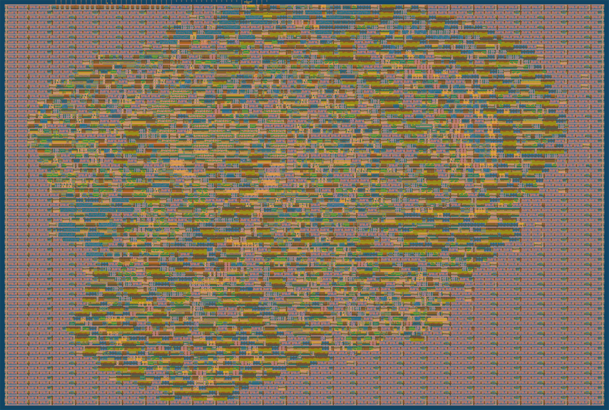

   

# ROM-less CORDIC engine for Tiny Tapeout
This ROM-less cordic engine is written for [Tiny Tapeout SKY25a shuttle](https://github.com/TinyTapeout/tinytapeout-sky-25a). It implements a [COordinate Rotation Digital Computer or CORDIC](https://ieeexplore.ieee.org/document/5089431) which work on a 16-bit signed fixed-point input Q3.16 (1 sign bit, 3 integer bits, and 12 fraction bits). This engine utilizes SPI-slave interface to receive four 16-bit signed fixed-point inputs (atan₀, alpha, x, y) and returns three 16-bit signed fixed-point outputs (alpha, cosθ, sinθ). 

- [Read the documentation for project](docs/info.md)
- [Try this verilog design on FPGA](https://github.com/rohanverma94/ttsky-romless-cordic-engine/tree/main/fpga)
- [Check 3D render of silicon here](https://gds-viewer.tinytapeout.com/?process=SKY130&model=https%3A%2F%2Frohanverma94.github.io%2Fttsky-romless-cordic-engine%2F%2Ftinytapeout.gds)

## Specification
- Tile area: 334.88um x 225.76um	
- Stdcell count: 4042 total cells (excluding fill and tap cells)
- Routing utilization : 41.216 %
- Max Clk freq supported by design: 50 MHz
- No. of inputs: 3 
  - SCLK
  - MOSI
  - CS_N
- No. of outputs: 2 
  - MISO
  - INTERRUPT
  

  

<em>2D render for the ROM-less CORDIC Engine</em>

## Our Team

[Rohan Sundar](https://github.com/rsundar), [Rohan Verma](https://github.com/rohanverma94/) 
and [Jyotinder Singh](https://github.com/JyotinderSingh)

While building the foundation for math processors on ASIC, we learnt a lot. 

[Vicharak Team](#Vicharak's-Engineering-Team) engineered a good synthesizable RTL that has been thoroughly tested and integrates beautifully with open-source tools. 

[Rohan Sundar](https://github.com/rsundar) and [Kasetty Praveen Kumar](https://github.com/Kasetty-Praveen-Kumar) were instrumental in simplifying the CORDIC engine’s math to enable a ROM-less design. A special mention to [Rishik Ram Jallarapu](https://github.com/Marcvi19) for his dedicated contributions in verification, GDS generation, and gate-level simulations.

## Vicharak's Engineering Team   
[Devang Kabutarwala](https://github.com/djkabutar),
[Kasetty Praveen Kumar](https://github.com/Kasetty-Praveen-Kumar),
[Rishik Ram Jallarapu](https://github.com/Marcvi19),
[Deepak Sharda](https://github.com/dpks2003),
[Tejas Dabhankar](https://github.com/tejdabhankar),
[Akshar Vastarpara](https://github.com/akshar001)

## 🙏 Acknowledgment

Huge thanks to [**Vicharak's Engineering Team**](https://vicharak.in) 🏆   for their expertise in **mathematics, RTL design, and testbench simulations**. 

Thanks to Matthew Venn, Uri Shaked and whole Tiny Tapeout team for answering our queries related to ASIC.

This tapeout simply wouldn’t have been possible without their hard work and support.
