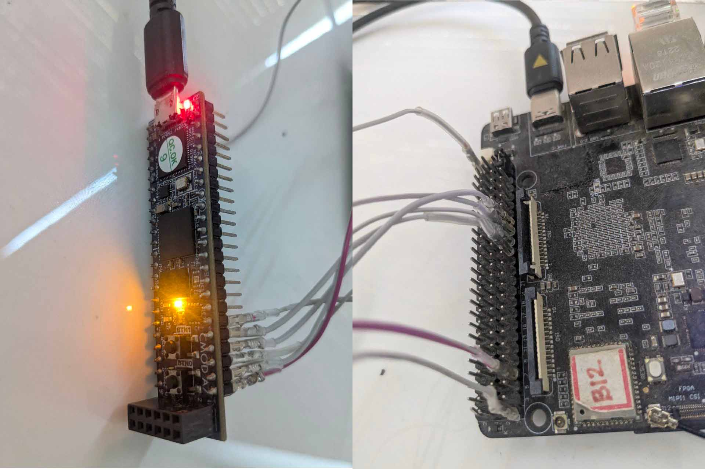

## Implementation of Romless Cordic on Digilent CMOD A7

CMOD A7 is a breadboard-compatible fpga development kit. [info](https://digilent.com/shop/cmod-a7-35t-breadboardable-artix-7-fpga-module/)

### What you need:
- All the wires should be of identical lengths.
- Any controller which supports SPI protocol

For the example, we are going to use Linux-supported SPI devices, i.e., Vaaman or Raspberry Pi.

- In order to start working with the Linux SPI device, make sure you enable the spidev from the kernel.

### Pin assignments:

| Pin    | FPGA Pin | Vaaman Pin |
|--------|----------|------------|
|`sclk`  |   PIO1   |      7     |
|`mosi`  |   PIO2   |     29     |
|`miso`  |   PIO3   |     31     |
|`cs_n`  |   PIO4   |     33     |



### Running the Test

```bash
python spi_cordic_test.py
```

> [!NOTE]
>
> Make sure to change the SPI device on which you connected the FPGA. You can change that in the file where spidev is opening.
